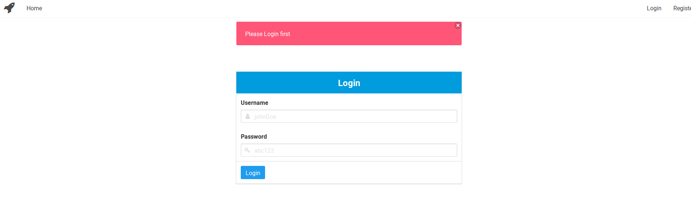
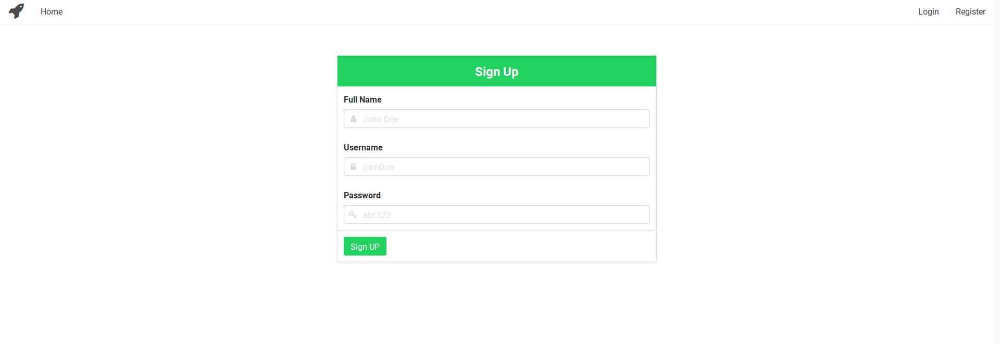
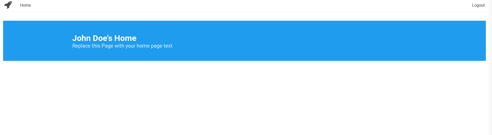

# Node_Starter-1.0: NodeJS Authentication Boiler plate

Node starter is basic login and register system, ready to use for any NodeJS project. It is a simple boilerplate with essential validation and functions of minimal authentication mechanisms. Available for everyone to use or modify. Pug(Formerly Jade) view engine is used in this project and Bulma CSS is used for the frontend.

 1. Login page screenshot
 2. Register page screenshot
 3. Home page screenshot

## Features
  - Simple Login/Register page.
  - Styled with Bulma CSS.
  - Modular and uses Mongoose, Passport etc for various functionalities.

## Setup
- Run `npm install` for installing all needed `npm modules`.
- After installation start node server by running the command `npm start`.
- By default, it will run on 3000, so go to `localhost:3000`.